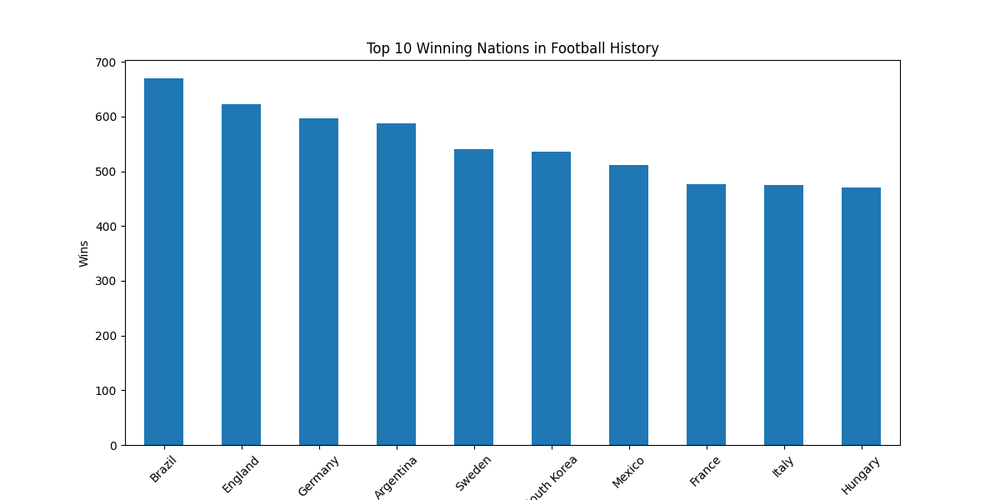
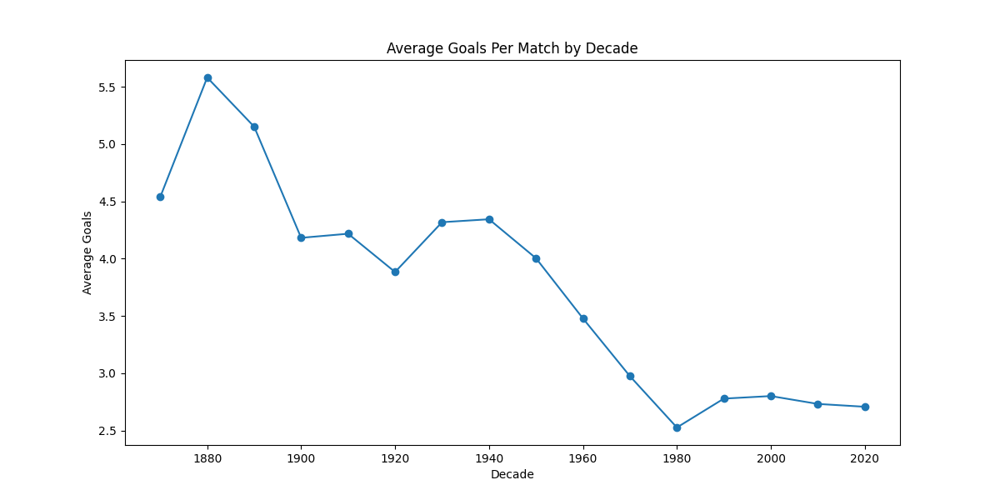

# International Football Analytics Project

## Overview

This project analyzes nearly 50,000 international football matches using Python, Pandas, Matplotlib, and Seaborn.

The project explores:

* Winning nations
* Goal trends over time
* FIFA World Cup performance
* Home advantage
* Tournament statistics
* High-scoring matches

---

## Tools Used

* Python
* Pandas
* Matplotlib
* Seaborn
* Jupyter Notebook

---

## Dataset Information

The dataset contains:

* Match dates
* Home and away teams
* Scores
* Tournament names
* Match locations
* Neutral venue information

Total Matches Analyzed: ~49,000

---

## Key Insights

* Traditional football nations dominate historical win counts.
* Goal averages fluctuate significantly across decades.
* Home teams hold a measurable advantage in international football.
* FIFA World Cup matches reveal consistent elite-performing nations.

---

## Visualizations Included

* Top Winning Nations
* Highest Scoring Nations
* Goal Trends by Decade
* World Cup Winners Analysis
* Tournament Frequency
* Correlation Heatmap

---

## Sample Visualizations

### Top Winning Nations


### Goals by Decade


## Project Structure

```text
Football_Analytics_Project/
│
├── datasets/
├── notebooks/
├── charts/
├── README.md
└── requirements.txt
```

---

## Author

Arpit Singh


